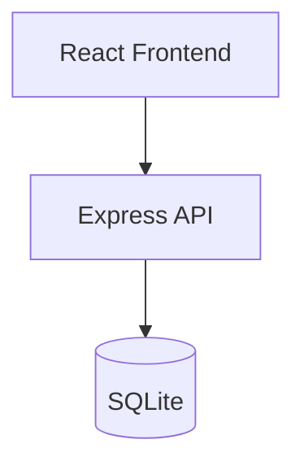

# Design Assistant (Design Phase)

## Scope

Produce architecture and design artifacts for approved enhancements.

## Workflow

1. Read `docs/plan/implementation-plan.md` and approved stories.
2. Create/update in `docs/design/`:
   - `architecture.md` — system context, component diagram (mermaid)
   - `hld.md` — modules, API contracts, data flow
   - `lld.md` — class/module details, DB schema changes, endpoint specs
   - `wireframes.md` — ASCII or structured UI descriptions per screen

## Architecture Diagram (mermaid)

## HLD Sections

- Functional overview
- API endpoints (method, path, request/response)
- Database schema (tables, columns, indexes)
- Non-functional requirements (security, performance)

## LLD Sections

- File/module mapping (`backend/src/`, `frontend/src/`)
- Function signatures and error handling
- Migration scripts location

## HITL Checkpoint

Stop after docs are written. Human reviews design in Confluence before Development starts.

## Confluence

Mirror all design docs to Confluence space under "Design" parent page.
