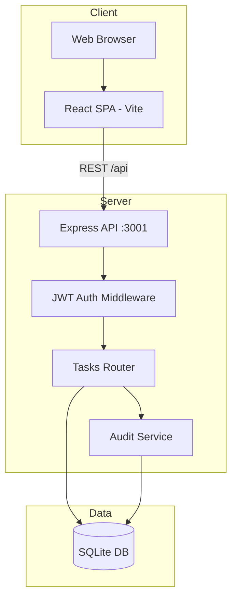
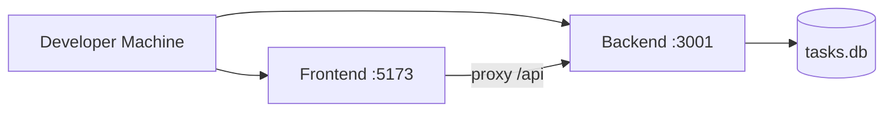

# Architecture — Task Manager

**Version:** 1.0 (Baseline + Planned Enhancements)  
**Status:** Pending HITL Review

---

## System Context

---

## Components

| Component | Technology | Responsibility |
|-----------|------------|----------------|
| Frontend | React 18, Vite | UI, forms, task list, auth screens |
| API Gateway | Express 4 | HTTP routing, JSON, CORS |
| Auth | JWT + bcrypt | Register, login, route protection |
| Task Service | node:sqlite | CRUD, filter, search |
| Audit Service | node:sqlite | Change history logging |
| Database | SQLite | Persistent storage |

---

## Deployment (Local)

Production build: Vite outputs static files to `frontend/dist`; Express can serve them or use separate static host.

---

## Security (Planned)

- Passwords hashed with bcrypt (cost factor 10)
- JWT in Authorization: Bearer header
- Parameterized SQL queries only
- CORS restricted to localhost in dev

---

## Confluence

Mirror this page to: **Design > Architecture**
