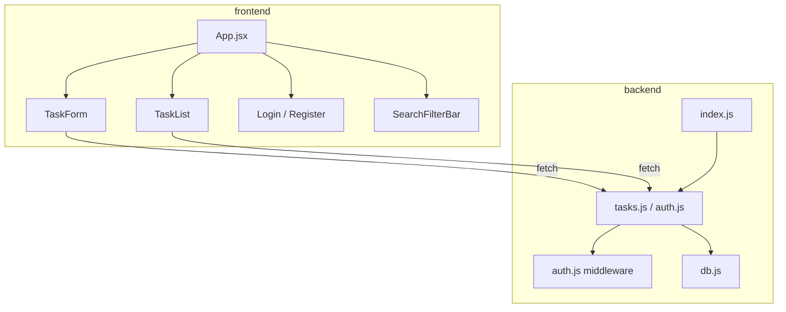
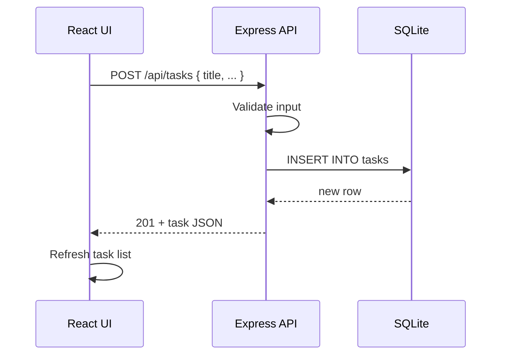

# High-Level Design (HLD) — Task Manager

**Version:** 1.0  
**Status:** Pending HITL Review

---

## Functional Overview

Task Manager allows users to create, view, update, and delete tasks. Planned enhancements add authentication, search/filter, categories, due-date visibility, and audit history.

---

## Module Diagram



---

## API Contract (Baseline + Planned)

### Baseline (Implemented)

| Method | Path | Description |
|--------|------|-------------|
| GET | /api/health | Health check |
| GET | /api/tasks | List all tasks |
| GET | /api/tasks/:id | Get task by id |
| POST | /api/tasks | Create task |
| PUT | /api/tasks/:id | Update task |
| DELETE | /api/tasks/:id | Delete task |

### Planned — Auth

| Method | Path | Description |
|--------|------|-------------|
| POST | /api/auth/register | Create user account |
| POST | /api/auth/login | Return JWT |

### Planned — Tasks (Enhanced)

| Method | Path | Query Params |
|--------|------|--------------|
| GET | /api/tasks | status, q, category, due_before, due_after, sort |
| GET | /api/tasks/:id/history | — |

---

## Data Flow — Create Task



---

## Database Schema (Current)

```sql
tasks (
  id INTEGER PK,
  title TEXT NOT NULL,
  description TEXT,
  status TEXT CHECK (todo|in_progress|done),
  due_date TEXT,
  created_at TEXT,
  updated_at TEXT
)
```

### Planned Additions

```sql
users (id, email UNIQUE, password_hash, name, created_at)
tasks.user_id → users.id
tasks.category TEXT
task_audit (id, task_id, user_id, action, field, old_value, new_value, created_at)
```

---

## Non-Functional Requirements

| NFR | Target |
|-----|--------|
| Response time | < 200ms for list (100 tasks) |
| Availability | Local dev single-instance |
| Security | JWT auth, hashed passwords |
| Test coverage | E2E for all CRUD + auth flows |

---

## Confluence

Mirror to: **Design > HLD**
