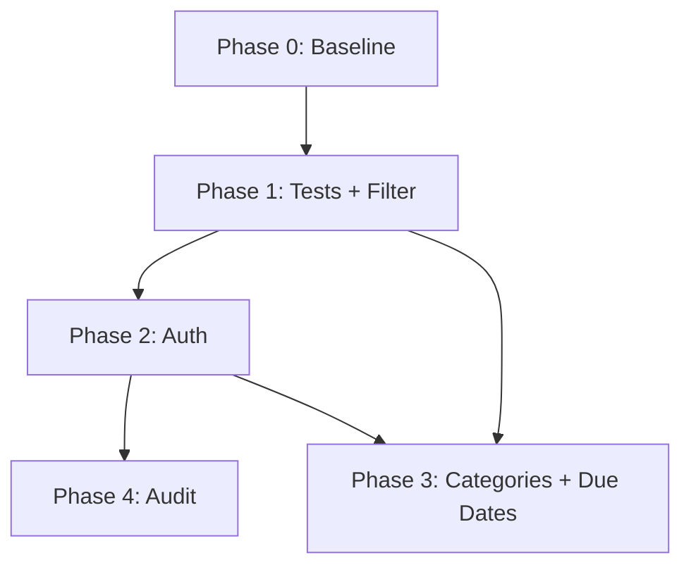

# Implementation Plan — Task Manager Enhancements

**Version:** 1.0  
**Date:** 2026-08-13  
**Author:** Planning Assistant  
**Status:** Pending HITL Review (Plan PR)

---

## Overview

This plan implements six EPICs identified in the gap analysis, organized into four sprints. The goal is to demonstrate the full AI-Assistant-Driven SDLC pipeline while delivering incremental, demo-ready value.

---

## Scope

### In Scope

- User authentication (JWT)
- Search and filter (status, keyword, due date)
- Task categories
- Overdue/due-today highlighting
- Audit trail (post-auth)
- Playwright E2E test suite
- Build and local deployment scripts

### Out of Scope

- Email notifications
- Real-time collaboration / WebSockets
- Cloud deployment (AWS/Azure)
- Mobile native apps

---

## Phases

### Phase 0: Foundation (Complete)

- [x] Baseline Task Manager (CRUD API + React UI)
- [x] SQLite schema and seed data
- [x] Project structure and SDLC skills
- [x] Gap analysis and Jira stories

**Exit criteria:** App runs locally; docs in `docs/analysis/`.

---

### Phase 1: Test Foundation + Search/Filter (Sprint 1)

**Stories:** TM-601, TM-201, TM-202  
**Duration:** ~1 week

| Deliverable | Owner |
|-------------|-------|
| Gherkin + Playwright for baseline CRUD | QA Assistant |
| Status filter API + UI | Dev Assistant |
| Keyword search API + UI | Dev Assistant |

**Dependencies:** None  
**Exit criteria:** E2E tests pass; filter and search work in UI.

---

### Phase 2: Authentication (Sprint 2)

**Stories:** TM-101, TM-102, TM-103  
**Duration:** ~1.5 weeks

| Deliverable | Owner |
|-------------|-------|
| users table, register/login API | Dev Assistant |
| JWT middleware, task scoping | Dev Assistant |
| Login/register UI, auth context | Dev Assistant |

**Dependencies:** Phase 1 tests as regression suite  
**Exit criteria:** Unauthenticated requests blocked; users see only their tasks.

---

### Phase 3: Categories + Due Dates (Sprint 3)

**Stories:** TM-301, TM-401  
**Duration:** ~1 week

| Deliverable | Owner |
|-------------|-------|
| Category column, filter, UI badges | Dev Assistant |
| Overdue/due-today styling, sort by due date | Dev Assistant |

**Dependencies:** Phase 2 (optional: categories work without auth in demo mode)  
**Exit criteria:** Categories assignable; overdue tasks highlighted.

---

### Phase 4: Advanced Filter + Audit (Sprint 4)

**Stories:** TM-203, TM-501  
**Duration:** ~1.5 weeks

| Deliverable | Owner |
|-------------|-------|
| Due date range filter | Dev Assistant |
| task_audit table, history API/UI | Dev Assistant |

**Dependencies:** Phase 2 (audit requires auth)  
**Exit criteria:** Date range filter works; change history visible per task.

---

## Technical Dependencies

---

## Risk Register

| Risk | Impact | Mitigation |
|------|--------|------------|
| Node version below 22.5 | Medium | Document Node 22.5+ requirement for node:sqlite |
| Auth scope creep | High | Stick to JWT; no OAuth in v1 |
| Test flakiness | Medium | Use data-testid; stable selectors |
| Confluence sync manual | Low | Documentation Assistant checklist |

---

## Demo Flow Mapping

| Demo Step | Phase Output |
|-----------|--------------|
| 1. Gaps identified | gap-analysis.md, Jira EPICs |
| 2. Requirements → HITL | jira-stories.md |
| 3. Plan → PR | This document (plan PR) |
| 4. Design → Confluence | docs/design/* |
| 5. Code → Git | Feature branches per story |
| 6. Code Review | PR comments |
| 7. Tests | Playwright + Gherkin |
| 8. Deploy | scripts/deploy-local.* |
| 9. Docs | README + Confluence |

---

## HITL Sign-off

- [ ] Plan approved by stakeholder
- [ ] Sprint order confirmed
- [ ] Proceed to Design phase
